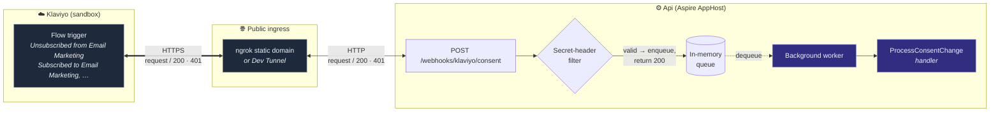

# Klaviyo consent webhooks: local testing against the sandbox



## Klaviyo setup

1. **Create a Klaviyo Sandbox account**
2. **Pick a shared webhook secret**
3. **Create four flows in the sandbox**
   - Subscribed to Email Marketing → `klaviyo/flow-webhook-bodies/email_subscribed.json`
   - Unsubscribed from Email Marketing → `klaviyo/flow-webhook-bodies/email_unsubscribed.json`
   - Subscribed to SMS Marketing → `klaviyo/flow-webhook-bodies/sms_subscribed.json`
   - Unsubscribed from SMS Marketing → `klaviyo/flow-webhook-bodies/sms_unsubscribed.json`

   Each flow has a single Webhook action with the following settings:
   - URL: `<DevTunnel URL> (https://<id>-5080.<region>.devtunnels.ms)`
   - Headers: `X-Klaviyo-Webhook-Secret: <secret>` and `X-Tunnel-Skip-AntiPhishing-Page: true`
   - Body: the matching JSON file
   - Status: **Live**

## Per-developer setup

```bash
cd src/AppHost
dotnet user-secrets set "Parameters:klaviyo-webhook-secret" "<shared secret>"
dotnet user-secrets set "Tunnel:DevTunnelId" "acme-klaviyo-<param>"
```

## Testing

1. `dotnet run src/AppHost`
2. Inn the flow's Webhook action, **Preview → Send test request**. It fires right away with a sample profile
